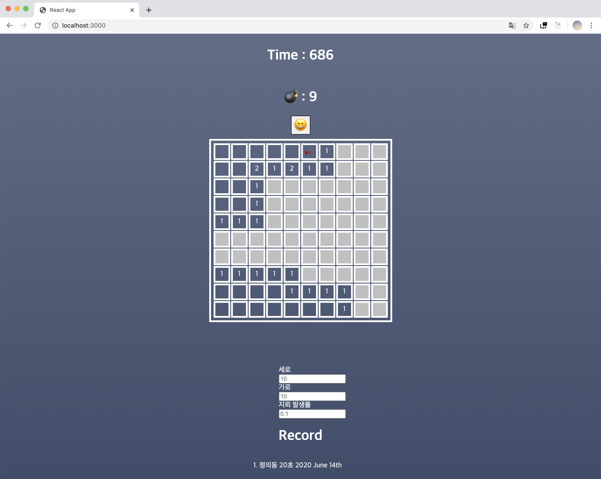

# 지뢰찾기 

<div align="center">

[](https://nodejs.org/en/blog/release/v13.14.0/)
[](https://github.com/facebook/react/blob/master/CHANGELOG.md#16131-march-19-2020)
[](https://dev.mysql.com/doc/relnotes/mysql/5.7/en/news-5-7-10.html)
[](https://docs.docker.com/engine/release-notes/)
[](https://kubernetes.io/blog/2019/09/18/kubernetes-1-16-release-announcement/)

</div>

<p align="center">

</p>


### 유의 사항

- 초기에 DB가 켜지기까지 시간이 걸릴 수 있습니다.
- Mysql Error 발생 시, build과정에서 생긴 docker 폴더를 삭제한다.

### DockerHub
- frontEnd : https://hub.docker.com/repository/docker/justicedong/mine-project_front
- backEnd : https://hub.docker.com/repository/docker/justicedong/mine-project_back 


### KUBERNETES 관련 사항
- back-end 이미지와 front-end 이미지는 docker hub를 통해 업로드하였다.
- 실행

```bash
minikube start

kubectl apply -f db-persistentClaim.yml
kubectl apply -f db-deployment.yml
kubectl apply -f db-service.yml

kubectl apply -f back-end-deployment.yml
kubectl apply -f back-end-service.yml

kubectl apply -f front-end-deployment.yml
kubectl apply -f front-end-deploymnet.yml
```

- localhost에 mapping

front와 back의 소통은 외부 통신이기 때문에 port forwarding을 수행해주어야 한다.

```bash
kubectl port-forward service/mine-back 8000:8000
```

```bash
kubectl port-forward service/mine-front 3000:3000
```

